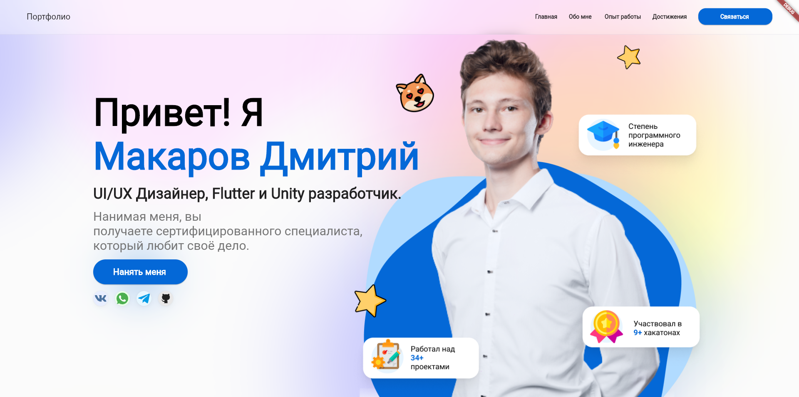

<div align="center">

# Portfolio Flutter Web

**Персональное web-портфолио Дмитрия Макарова — Unity-разработчика, преподавателя и инженера, увлечённого созданием интерактивных продуктов.**

Flutter Web · Dart · Nginx · Docker

[GitHub профиль](https://github.com/mentoster) · [Репозиторий](https://github.com/mentoster/portfolio_flutter_web) · [Сообщить о проблеме](https://github.com/mentoster/portfolio_flutter_web/issues)

</div>

<p align="center">
  
</p>

## О проекте

`portfolio_flutter_web` — frontend-only портфолио на Flutter Web. Сайт объединяет профессиональную информацию, проекты, опыт работы, используемые технологии, дипломы, сертификаты и контакты в одном интерактивном интерфейсе.

Контент хранится непосредственно в Dart-моделях и статических assets, поэтому проект не требует backend для отображения основных страниц. Для web-навигации используются чистые URL без `#`, включая отдельные страницы проектов.

Основные маршруты:

- `/` — главная страница портфолио;
- `/projects` — каталог проектов;
- `/projects/<name>` — отдельная страница проекта.

## Что есть на сайте

- Hero-секция с представлением, CTA и ссылками на социальные сети.
- Раздел «Обо мне» и подборка проектов.
- Таймлайн профессионального опыта: Unity, RTUITLab, Flutter, UI/UX и преподавание Unity.
- Визуальный список инструментов и технологий.
- Дипломы и сертификаты из локальных assets.
- Отдельные страницы проектов с описанием и галереей.
- Контактная секция и внешние ссылки через `url_launcher`.
- Web-friendly asset loading через современный Flutter `AssetManifest` API.
- SPA routing с корректной поддержкой deep links при раздаче через Nginx.

## Технологии

| Область | Используется |
| --- | --- |
| UI | Flutter Web |
| Язык | Dart 3 |
| SVG | `flutter_svg` |
| Анимации | `simple_animations`, `animated_text_kit` |
| Галереи | `carousel_slider`, `card_swiper` |
| Внешние ссылки | `url_launcher` |
| Web serving | Nginx |
| Контейнеризация | Docker Compose |
| Дополнительный hosting config | Firebase Hosting |

Само портфолио также демонстрирует опыт с Unity, Flutter, Dart, Figma, VS Code, Docker, Git, Linux, Python, Firebase и другими инструментами.

## Быстрый запуск

Понадобится установленный Flutter со стабильным Dart 3 SDK. Ограничение проекта в `pubspec.yaml`: `>=3.0.0 <4.0.0`.

```bash
git clone https://github.com/mentoster/portfolio_flutter_web.git
cd portfolio_flutter_web
flutter pub get
flutter run -d chrome
```

После запуска Flutter откроет локальную web-версию приложения в браузере.

## Production-сборка

```bash
flutter build web --release
```

Готовый статический сайт появится в:

```text
build/web/
```

Эту директорию можно раздавать любым статическим web-сервером с поддержкой SPA fallback для маршрутов приложения.

## Локальный Nginx

В репозитории уже есть готовая конфигурация:

```text
deploy/nginx.conf
docker-compose.hosting.yml
```

После release-сборки сайт можно поднять через Docker Compose:

```bash
docker compose -f docker-compose.hosting.yml up -d web7
```

После этого портфолио доступно по адресу:

```text
http://127.0.0.1:4077
```

Конфигурация Nginx разделяет Flutter-маршруты и статические ресурсы: deep links получают `index.html`, а отсутствующие assets возвращают настоящий `404`, а не HTML приложения.

## Архитектура

```mermaid
flowchart LR
    Browser[Browser] --> Web[Flutter Web]
    Web --> Routes[Application routes]
    Web --> Data[Dart content models]
    Web --> Assets[Images and SVG assets]
    Nginx[Nginx / Docker] -. optional serving .-> Web

    Routes --> Home[/]
    Routes --> Projects[/projects]
    Routes --> Project[/projects/name]
```

Приложение не использует backend: страницы собираются из Flutter UI, локальных Dart-данных и статических ресурсов.

## Структура репозитория

```text
lib/
├── main.dart                         # entry point
└── app/
    ├── data/
    │   ├── information_data/         # проекты, дипломы, сертификаты
    │   └── models/                   # модели данных
    ├── routes/                       # маршрутизация
    └── ui/
        ├── main_page/                # главная страница
        ├── projects_page/            # каталог проектов
        └── project_page/             # страница проекта

assets/                               # изображения и SVG
web/                                  # Flutter Web bootstrap

deploy/nginx.conf                     # конфигурация Nginx
docker-compose.hosting.yml            # локальный hosting container
test/                                 # smoke и regression tests
github_assets/preview.png             # preview для README
```

## Проверка проекта

Перед публикацией изменений используются стандартные проверки Flutter:

```bash
flutter analyze --no-fatal-infos
flutter test
flutter build web --release
```

Тесты включают smoke-проверку портфолио и regression coverage для загрузки SVG-иконок через современный `AssetManifest`.

## Web-реализация

Проект был модернизирован для современного Flutter Web. В частности:

- старый JSON-парсинг `AssetManifest.json` заменён на `AssetManifest.loadFromAssetBundle`;
- web bootstrap вынесен в `web/flutter_bootstrap.js`;
- удалены тяжёлые постоянно перерисовывающиеся полноэкранные эффекты;
- оптимизирована загрузка крупных изображений дипломов и сертификатов;
- Nginx настроен так, чтобы SPA fallback не маскировал отсутствующие статические файлы;
- legacy Flutter service workers корректно удаляются при загрузке сайта.

## Текущее состояние

Проект остаётся живым портфолио и постепенно модернизируется без переписывания с нуля.

Сейчас важно учитывать несколько ограничений:

- интерфейс в первую очередь ориентирован на desktop и ещё требует дальнейшей responsive-доработки;
- часть карточек проектов пока используется как заглушки;
- контактная форма является UI-элементом и не отправляет данные на backend;
- test suite пока небольшой и покрывает прежде всего ключевые regression-сценарии.

## Автор

**Дмитрий Макаров**<br />
Unity Developer · Flutter enthusiast · Unity Teacher

- GitHub: [@mentoster](https://github.com/mentoster)
- Telegram: [@mentoster](https://t.me/mentoster)
- VK: [mentoster_official](https://vk.com/mentoster_official)

---

<div align="center">
  <sub>Built with Flutter Web and maintained as a real portfolio project.</sub>
</div>
